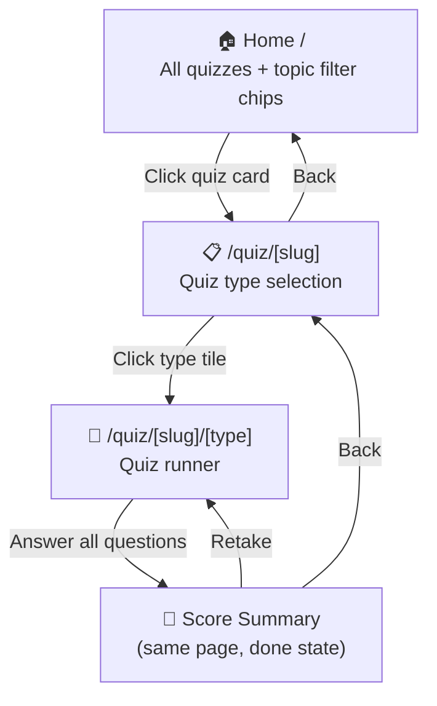
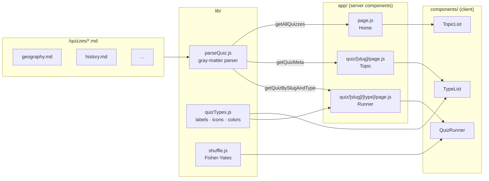
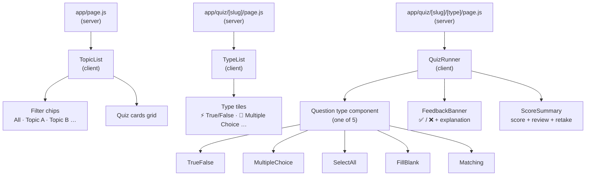
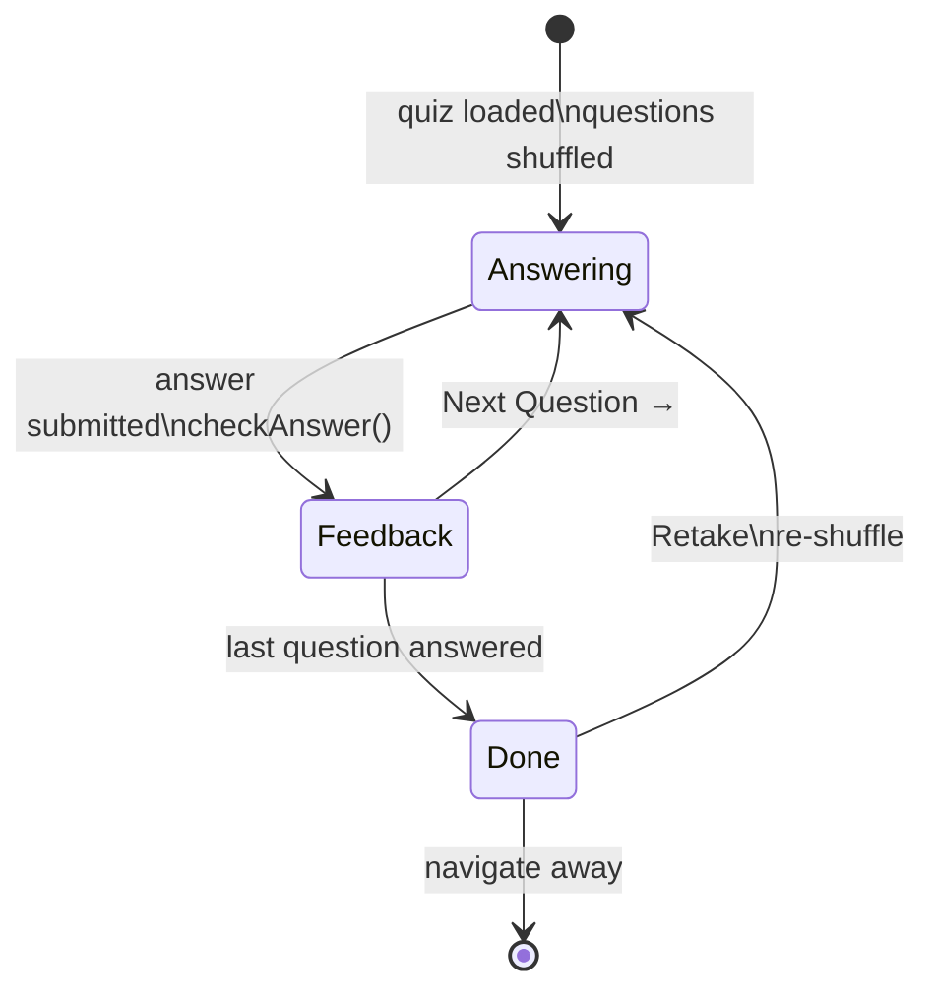
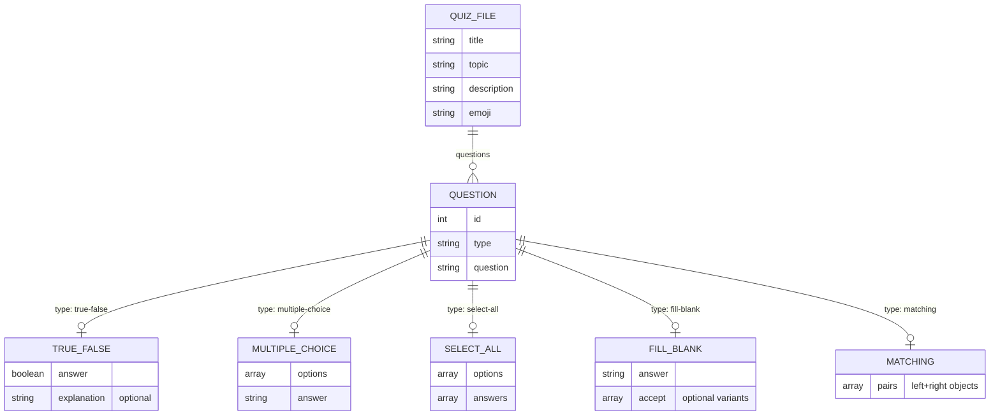

# CLAUDE.md

This file provides guidance to Claude Code (claude.ai/code) when working with code in this repository.

## Commands

```bash
npm run dev       # Start dev server at localhost:3000
npm run build     # Production build
npm run start     # Start production server
vercel            # Preview deploy
vercel --prod     # Production deploy
```

## Architecture

**Stack:** Next.js 16 (App Router) · JavaScript · Tailwind CSS v4 · gray-matter

---

## Diagrams

### 1. User navigation flow



### 2. Data flow — from .md files to UI



### 3. Component tree



### 4. Quiz state machine (QuizRunner)



### 5. Quiz `.md` file schema



---

## Quiz `.md` file format

All content is in YAML frontmatter. The markdown body is unused.

```yaml
---
title: "..."
topic: "..."          # used for filter chips on home page
description: "..."
emoji: "🧪"           # displayed on home page tile (default: 📚)
questions:
  - id: 1
    type: true-false
    question: "..."
    answer: true
    explanation: "..."   # optional — shown after answer is submitted

  - id: 2
    type: multiple-choice
    question: "..."
    options: ["A", "B", "C", "D"]
    answer: "B"

  - id: 3
    type: select-all
    question: "..."
    options: ["A", "B", "C", "D"]
    answers: ["A", "C"]

  - id: 4
    type: fill-blank
    question: "The answer is ___."
    answer: "foo"
    accept: ["foo", "Foo"]   # all accepted variants (case-insensitive match also applied)

  - id: 5
    type: matching
    question: "..."
    pairs:
      - left: "A"
        right: "1"
      - left: "B"
        right: "2"
---
```

**Adding a new quiz:** drop a new `.md` file in `/quizzes/`. It appears on the home page automatically. If its `topic` value is new, a new filter chip is added automatically.
