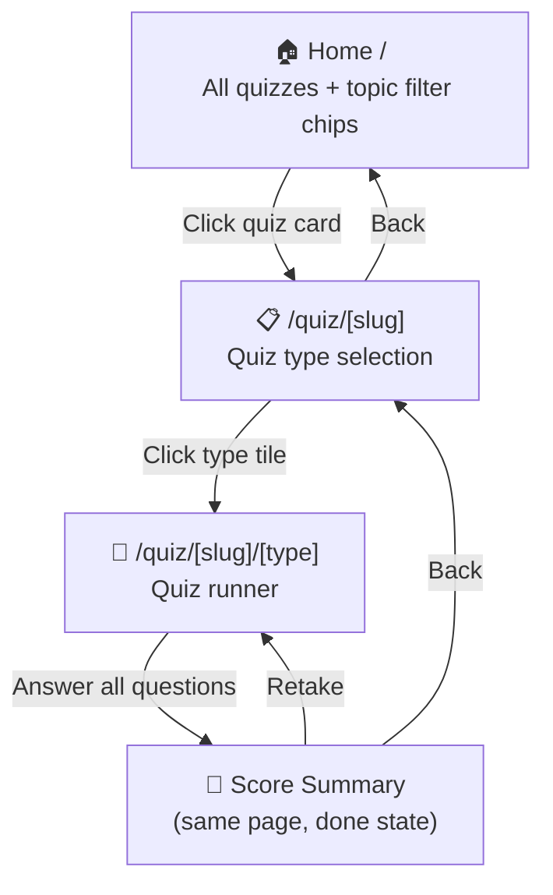
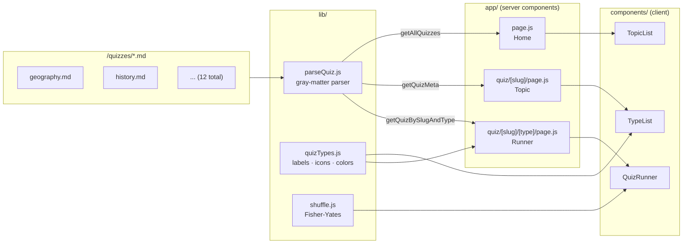
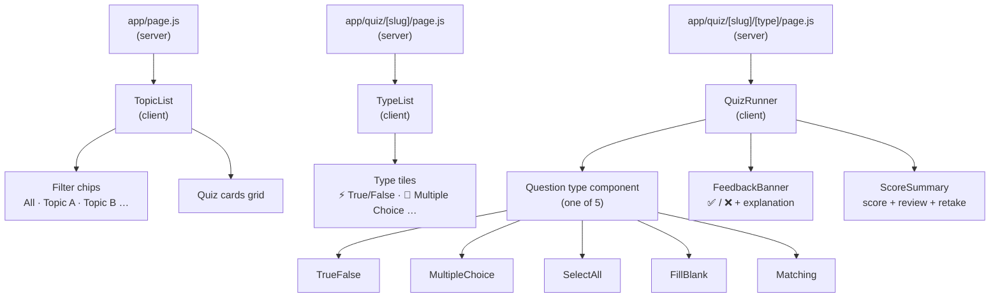
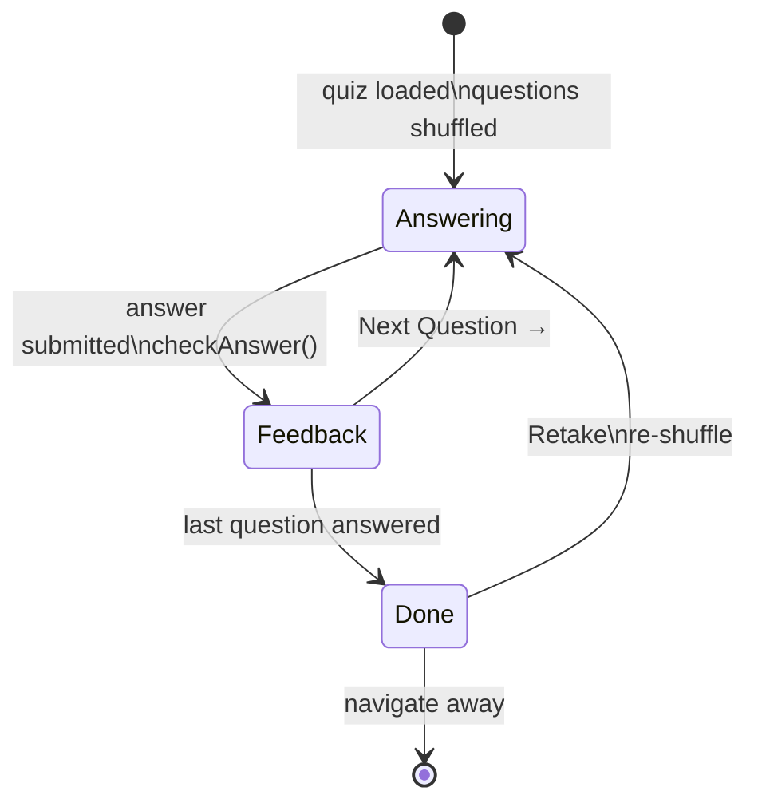
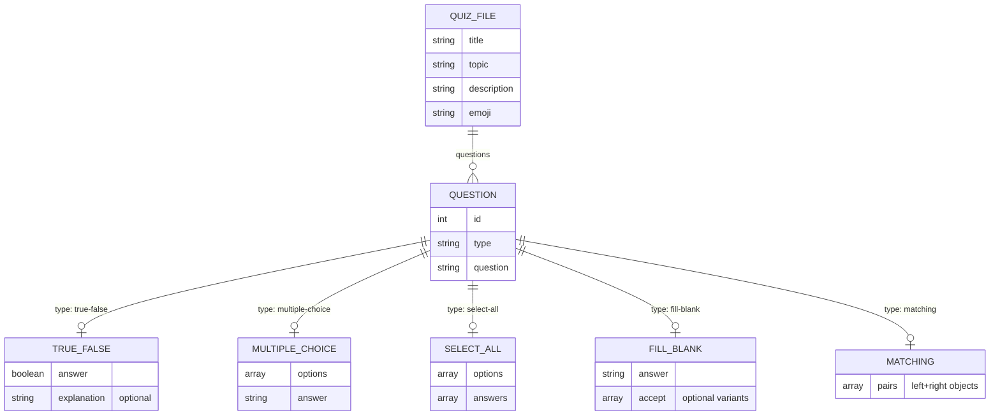

# CLAUDE.md

This file provides guidance to Claude Code (claude.ai/code) when working with code in this repository.

## Commands

```bash
npm run dev       # Start dev server at localhost:3000
npm run build     # Production build
npm run start     # Start production server
git push          # Auto-deploys via Vercel (connected to GitHub)
```

## Project links

- **Live app:** https://quiz-practice.vercel.app
- **GitHub:** https://github.com/ziolkowskid06/quiz-practice
- **Vercel dashboard:** https://vercel.com/dashboard

---

## Architecture

**Stack:** Next.js 16 (App Router) · JavaScript · Tailwind CSS v4 · gray-matter

### Routing (3 levels)

```
/                          → Home: all quizzes, filter chips by topic
/quiz/[slug]               → Topic page: quiz type selection tiles
/quiz/[slug]/[type]        → Quiz runner for a specific type within a quiz
```

### Data flow

- `/lib/parseQuiz.js` — all file I/O. Key exports:
  - `getAllQuizzes()` — metadata for all `.md` files (home page)
  - `getQuizMeta(slug)` — metadata + `types[]` + `typeCounts{}` (topic page)
  - `getQuizBySlugAndType(slug, type)` — questions filtered to one type (quiz runner)
- `/lib/quizTypes.js` — client-safe constants: `TYPE_LABELS`, `TYPE_ICONS`, `TYPE_COLORS`. Kept separate from `parseQuiz.js` so client components can import them without pulling in `fs`/`path`.
- `/lib/shuffle.js` — single Fisher-Yates `shuffle(array)` utility.

### Component tree

```
app/page.js (server)
  └── TopicList (client) — filter chips + quiz card grid

app/quiz/[slug]/page.js (server)
  └── TypeList (client) — one tile per question type present in the quiz

app/quiz/[slug]/[type]/page.js (server)
  └── QuizRunner (client) — owns all quiz state
        ├── TrueFalse / MultipleChoice / SelectAll / FillBlank / Matching
        ├── FeedbackBanner — shown after each answer; renders explanation for true-false
        └── ScoreSummary — end screen with score + per-question review
```

### Quiz content

12 quiz files in `/quizzes/` covering: General, Geography, Science, History, Programming, Entertainment, Nature, Space, Food, Sports, Music, Math.

Full quiz file format specification: **[QUIZ_FORMAT.md](./QUIZ_FORMAT.md)**

---

## Diagrams

### 1. User navigation flow



### 2. Data flow — from .md files to UI



### 3. Component tree



### 4. Quiz state machine (QuizRunner)



### 5. Quiz `.md` file schema


